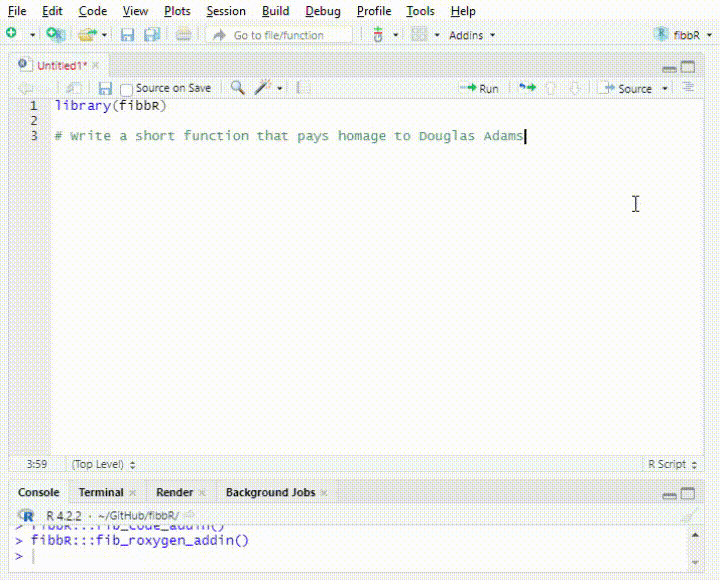

# fibbR - a fairly minimal GPT addin for RStudio




Why did I write this? Mostly for fun and the streaming functionality, which I hadn't seen in another native R package / RStudio addin at that point (might have changed by now).

The package includes the following functions (and addins, see below):

- `fib_code()`: Generates an R script based on a given prompt.
- `fib_roxygen()`: Generates a roxygen docstring for a given code snippet.
- `fib()`: Sends a request to the specified model with a given prompt and optional parameters.


## Installation

```R
# Install the development version from GitHub
# install.packages("devtools")
devtools::install_github("https://github.com/robertsehlke/fibbr")
```

## Usage

### Model

Set the default model using `fib_set_default_api("openai")` (gpt-4o) or `fib_set_default_api("claude")` (claude 3.5 sonnet).

### Authentication

On first use of one of the functions in this package, you will be prompted for your API key (OpenAI or Claude). This key will be saved in your system credential store using the [keyring](https://cran.r-project.org/web/packages/keyring/index.html) package.

If you need to set the token again, e.g., because it expired, you can use the fib_set_token("openai") or fib_set_token("claude") function to call up the prompt manually.

### Calling functions directly

```R
library(fibbr)

# Generate R code
fib_code("Calculate the sum of 1 to 10")

# Create a roxygen docstring for a code snippet
fib_roxygen("example_function = function(x) { return(x + 1) }")

# Send a custom request to the model
fib("What is the meaning of life?", api="openai")
```

### RStudio Addins

Addins are also available for use in RStudio:

- `fib_code_addin()`: Generates code based on the selected text in the editor.
- `fib_roxygen_addin()`: Generates a roxygen docstring for the selected code snippet.
- `fib_code_with_context_addin()`: Generates code based on the selected text and the full file context.


## Other considerations

### Custom system prompts and history

Using the `fib` function directly, requests can be customised.

The function invisibly returns a nested list with the conversation history, which can be fed back in using the `history` parameter:

```
> h1 = fib("Hi there")
Hello! How can I help you?
> fib("What did I just say?", history = h1)
You said, "Hi there."
```

Adjust the system prompt:

```
> fib("Hi there", system_start_prompt = "You talk like a pirate.")
Ahoy there, matey!
```

### Streaming vs. no streaming

By default responses are streamed to the editor for `fib_code` and `fib_roxygen`. This can be controlled by setting the `stream` argument.


### Bugs and caveats

* Cosmetic: if "Insert matching parens/quotes" is active in the RStudio code settings, auto-generated streamed text can result in trailing parentheses.
* The package is called fibbR ("fibber") because LLMs will make shit up.
